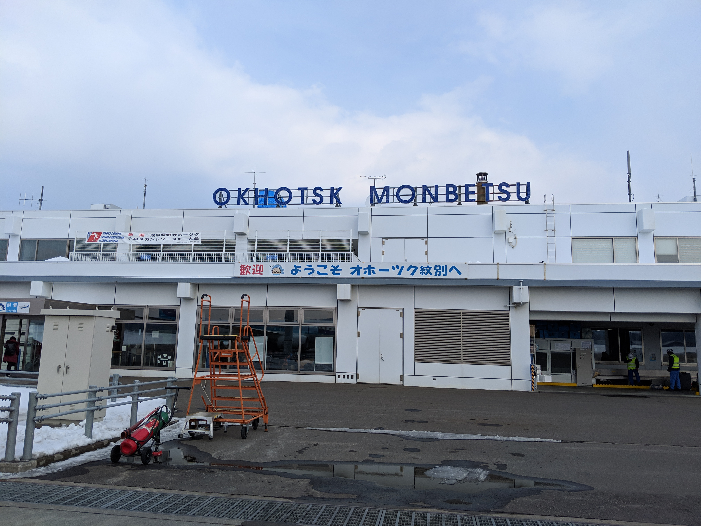
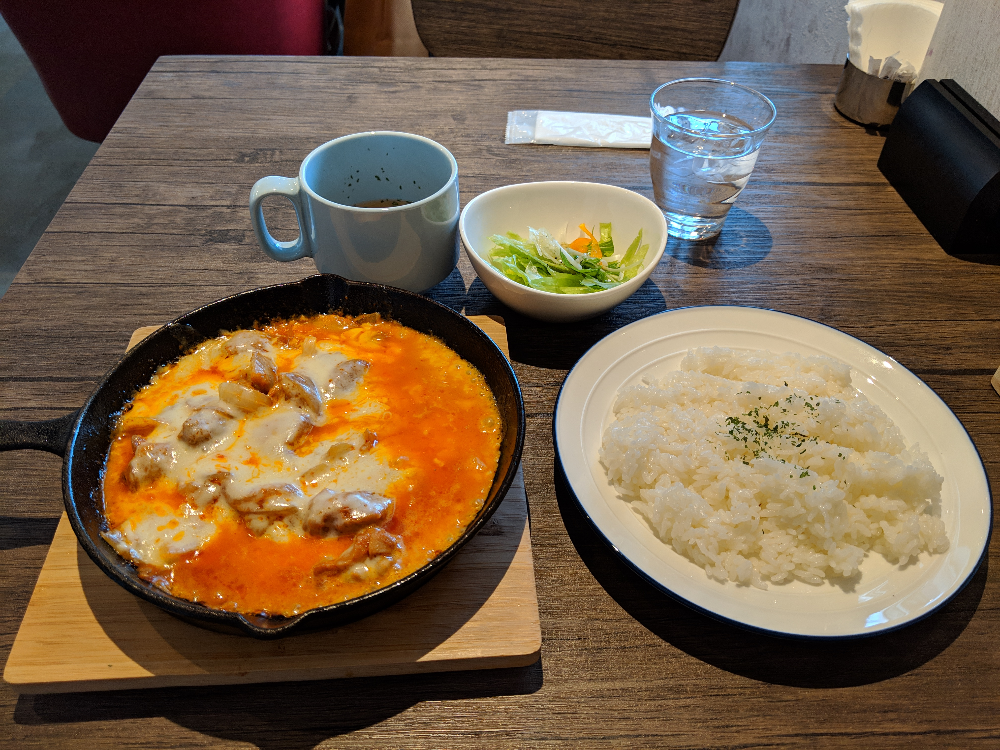
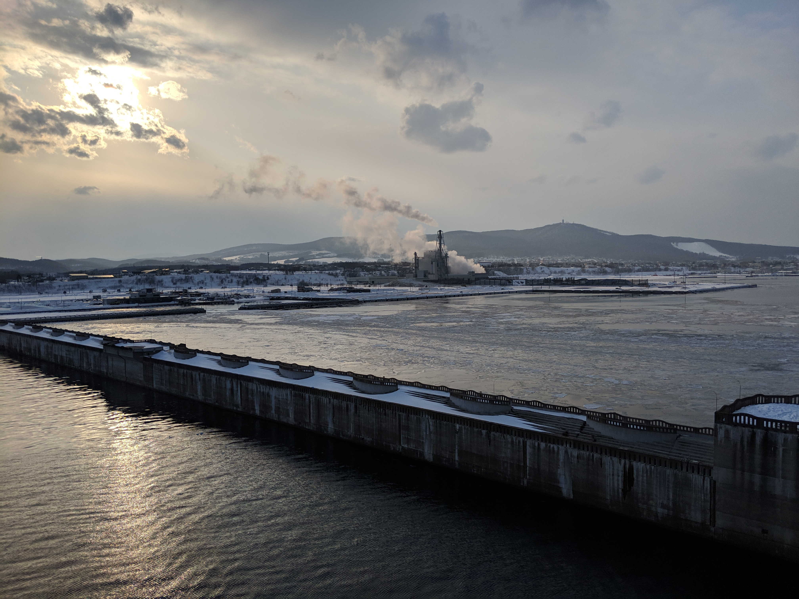
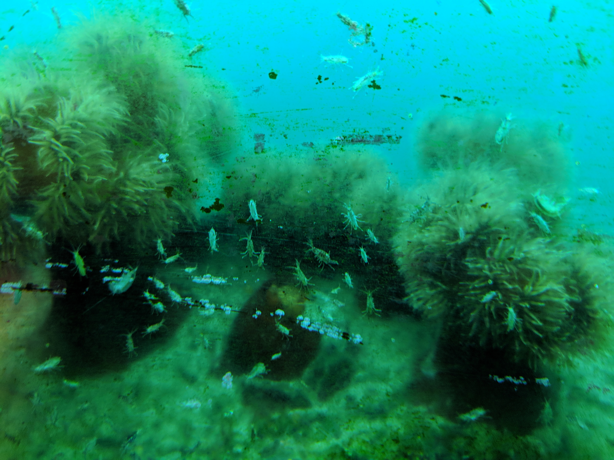
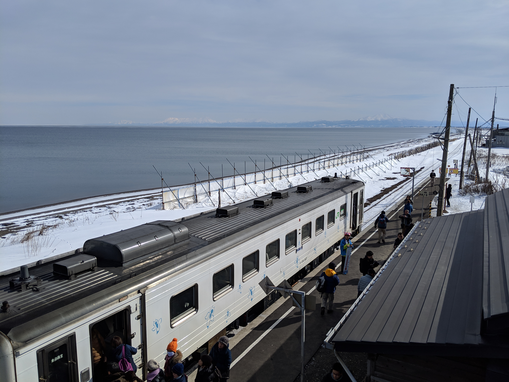
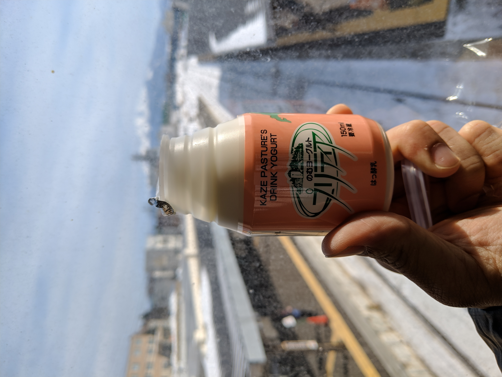

# 飞往紋別
年初ana机票有优惠价, 
里程多且价格合适, 
没多想就买了紋別的往返票, 
北海道的老龄化严重， 
定的座位正好在飞机尾部， 
一眼望去全是白发， 
只有几对带娃的夫妇， 
年轻人更是少的可怜， 
飞机刚上跑道就有位老爷爷身体不适， 
于是所有人跟着折返， 
把老爷爷送回机场后再走一遍流程才起飞， 
来去多耗费了一个多小时。 

纹别机场是个小机场， 
每天只有ANA的一趟航班， 
下飞机后没有想象中的冷， 
太阳照着甚至比东京暖和 

* 纹别机场
* 

在厕所里多思考了一会儿人生，就错过了班车, 
广播的时候没太在意，想无非就是等下一班车， 
问了工作人员才知道  
原来开往市区的班车有且只有一班， 
因为飞机也只有一班， 
去的士区打算打车， 
然而空空如也一辆的士也没有 

谷歌地图显示步行一个小时，走起！ 

# 温暖的小店
在雪地里走了一个多小时饥肠辘辘的时候， 
看到路对面正好有家咖啡店， 
先填饱肚子再说， 

店主人非北海道出生， 
厌倦了都市生活后搬到北海道的， 
正好碰上有各种辅助金， 
两层的木制小屋，白天咖啡馆晚上小酒吧， 
一楼经营二楼自住，后院有围栏 
春暖花开的时候可以带上自家的狗狗自由玩耍 

对于什么是幸福的人生， 
不同的人有着不同的解释， 
我想这种生活方式也是其中的一个答案。 

* 限定5份的芝士鸡肉
* 

点了一道每日限定5份的芝士鸡肉, 
不愧是北海道给的奶酪超多der。 

# 冰海展望塔
饭后想看海,于是来到了港口, 
正好破冰船也是从这出发, 
问了售票小哥情况, 
天气好,本日无流冰,所以票半价 
小哥的眼睛清澈,说今天没有流冰时皱起的眉头真诚, 
于是在小哥的推荐下定了第二天早上出发的船票, 

* 鄂霍次克塔上的展望台景色
* 

先去了名叫鄂霍次克塔的展望塔, 
推荐购买破冰船和展望塔的套票, 
展望塔共4层, 
3楼是展望台, 
2楼介绍了流冰的科研历史, 
1楼售票兼小卖部, 
到这里都平淡无奇， 
直达走到了地下1楼的迷你水族馆， 
水族馆位于水面下， 
钢化玻璃外就是鄂霍次克海， 
可以透玻璃观察着海里的各种动植物 

# 鄂霍次克的流冰
次日清晨迎着旭日出门, 
有了第一天的经验后主动把谷歌地图预估的时间乘以了1.5, 
北海道的早晨人可真少, 
准确的说，除了我其余的都是车, 
准时到达乘船处, 
昨天的小哥依旧一脸真诚的告诉我今天有流冰, 
破冰船从港口到流冰带半个小时， 
在流冰带破冰航行10分钟后返行, 

鄂霍次克海,是由西伯利亚群岛，北海道和库页岛夹出的陆缘海, 
中国古称北海,北海道的地名也是这么来的。 
沿着黑龙江流出的淡水稀释了海水浓度， 
加上北方吹来的冷空气形成了独特的流冰环境， 
据说这里是能观察到流冰最南的地方 

初见到流冰还是很兴奋的， 
虽说没有想象中的厚重， 
也没有北极熊趴在冰上捕鱼卖萌, 
船长说由于气候变暖，能看到的流冰年年变少了。 

# 错过有时是几小时，有时就是一辈子
看完流冰打算坐巴士到车站去下一个城镇， 
默认巴士站就在馆门口， 
到了时间点出门一看哪都没有巴士的影子， 
找停车场大爷一问，才发现巴士站远着呢， 
肯定是赶不及9点这班车了， 
无奈先折返回馆内至少有暖气有wifi， 
旅途的乐趣之一就是处理各种无法预测的情况。 

看着鄂霍次克海，百无聊赖的又玩了一个小时手机后， 
见窗外雪停了，寻思着赶紧先移动一段吧， 
途中正好经过昨日去的咖啡店， 
于是乎边解决温饱问题边看着时间等着车， 

北海道的巴士站可真贫啊， 
连个遮雪的顶或座的凳子都没， 
就一个告示牌，一大半还埋在雪里。 

* 被埋雪中的巴士告示牌
* 

大雪中眼看这时间慢慢过了预定到达的时间， 
心中想象着各种可能性和对应的方法， 
无数次抖落掉堆积在背包上的雪, 
在就要放弃的时候巴士不缓不慢的来了 

毕竟这是自然环境恶劣的北海道， 
你又能说什么呢，当然是选择原谅ta！ 

# 網走
由于纹别本地订不到酒店， 
有见到有其它文章介绍了網走， 
于是乎干脆把第二天的酒店和行程都改到了網走, 
纹别到刚走的直线距离并没多远， 
只是没有租车, 
巴士加火车4个多小时， 
加上候车时间,轻易的一个下午就没了， 
不过长途火车也是很宝贵的体验， 

思绪放空在白雪皑皑的银白色大地, 
由于乘客很少,一个人可以独占两排座位, 
本地大妈热情的教导了坐车的正确姿势， 
脱靴后把脚伸直直接放在对面的座位， 

* 这张图需要横过来看
* 

一张普通票享受到了豪华列车卧铺的待遇, 
看着窗外的雪景发呆， 
困了闭眼睡觉，醒了继续发呆, 
偶尔拿出pc记录一些文字, 
时间充裕且手机没信号, 
思想可以很集中又很放松。 

# 北滨:因为非诚勿扰而改变命运的小车站
釧網本线,连接着網走与釧路JR最北端的线路， 
由被流放到北海道的凶恶犯人建造, 
沿途有着大量优美的自然景观而受到铁道和摄影爱好者的追捧， 

另外由于人口流失, 
本地的居民和现有的游客完全无非支撑铁道的运营， 
线路的存废问题一直在被争论着, 
(JR民营化后无法盈利的路线会成为公司的负担而别抛弃), 
而对于本地居民来说没有了铁道对于生活的影响巨大, 
所以自发组织了很多宣传旅游招揽游客的活动, 

北滨车站本来只是默默无闻的小车站， 
之后由于电影非诚勿扰的取景地而火了, 
大批的中国游客来访在车站里留下"来此一游", 
后来其他游客也坐不住了， 
纷纷把自己的车票，邮票，名片留在了墙上， 
形成了独特的风景, 

车站内搭建的简易展望台可以看到远处的流冰， 
对岸世界遗产知床连峰伟岸的屹立在鄂霍次克海的另一端。 

行程里能看到鄂霍次克海的路程只有其中一段， 
一定要提前找好面向海的一面下座, 
每天有2班流冰物语特别列车， 
带解说，带贩卖特产， 
经过海边会开的慢一些给予足够的拍照时间, 
在北滨车也会停留10分钟让游客有时间下车观光。 

推荐本地的奶制品和肉制品, 
想要方式思考人生的朋友也推荐这里, 
没有过多的旅游景点,远离城市的喧嚣, 
面对大自然的残酷生活的简单平静而有力量。 

# 其它文章
[其它游记](../menu.md)  
[点击查看ANA里程攻略](https://github.com/cheungYX/algorithm/blob/master/cheung/ana.md)  
[东京购房攻略](https://github.com/cheungYX/algorithm/blob/master/cheung/ff.md)  
[东京购房攻略2⃣️](https://github.com/cheungYX/algorithm/blob/master/cheung/ff2.md)  
[保险攻略](https://github.com/cheungYX/algorithm/blob/master/cheung/hokken.md)  
[职业规划篇](https://github.com/cheungYX/algorithm/blob/master/cheung/work_root.md)  

